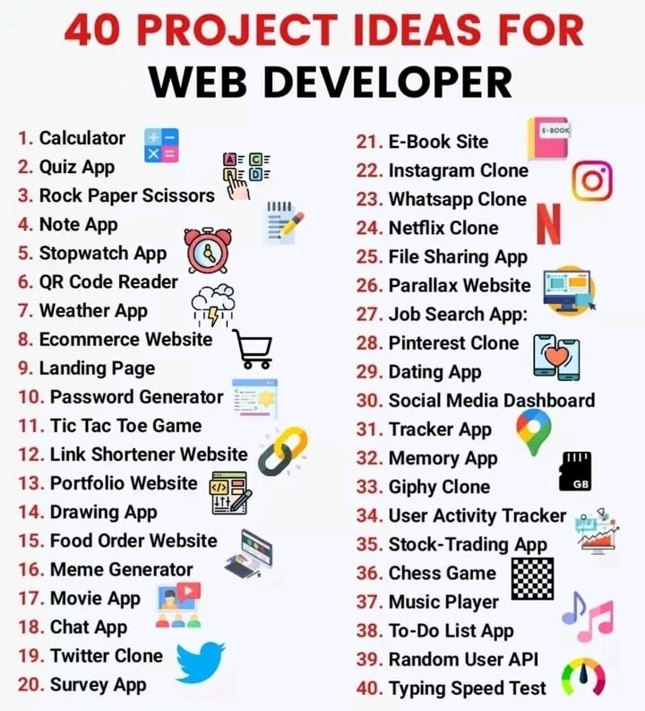

# 40 Web Development Projects  

This collection showcases **40 web development projects** built using **HTML**, **CSS**, and **JavaScript** as core technologies, along with frameworks like **React**, **Next.js**, and more. These projects range from beginner-friendly to advanced-level implementations, covering a wide spectrum of functionalities and features.  

---

## Project Highlights  

### Project 1: **Calculator App**  
- **Description:**  
  A fully functional calculator that performs basic arithmetic operations like addition, subtraction, multiplication, and division.  
- **Tech Stack:**  
  HTML, CSS, JavaScript  

---

### Project 2: **Sports Quiz Application**  
- **Description:**  
  An interactive quiz app covering various sports like football, basketball, athletics, and volleyball, allowing users to test their knowledge.  
- **Tech Stack:**  
  HTML, CSS, JavaScript  

---

### Project 3: **Rock, Paper, Scissors Game**  
- **Description:**  
  A classic implementation of the "Rock, Paper, Scissors" game, where users play against the computer.  
- **Tech Stack:**  
  HTML, CSS, JavaScript  

---

### Project 4: **Notes App**  
- **Description:**  
  A responsive note-taking web app built to help users organize their thoughts effectively.  
- **Tech Stack:**  
  HTML, CSS, JavaScript  

---

### Project 5: **Digital Stopwatch**  
- **Description:**  
  A responsive stopwatch application with start, stop, and reset functionalities.  
- **Tech Stack:**  
  HTML, CSS, JavaScript  

---

### Project 6: **QR Code Reader**  
- **Description:**  
  A responsive web application for scanning and decoding QR codes.  
- **Tech Stack:**  
  HTML, CSS, JavaScript  

---

### Project 7: **Weather App**  
- **Description:**  
  A weather forecasting application that provides real-time weather details like temperature, humidity, pressure, and wind speed using the OpenWeather Map API.  
- **Tech Stack:**  
  HTML, CSS, JavaScript, OpenWeather Map API  

---

### Project 9: **Landing Page**  
- **Description:**  
  A professional landing page presenting the Claudel Noubissie Business Group, inspired by Dr. Noubissie’s motivational content titled *"Learn to Sell, Drop the Jambo!"*.  
- **Tech Stack:**  
  HTML, CSS, JavaScript, React.js, Tailwind CSS  

---

### Project 10: **Secure Password Generator**  
- **Description:**  
  A password generator allowing users to customize the type of characters (letters, numbers, special characters) and the length of their password.  
- **Tech Stack:**  
  HTML, CSS, JavaScript  

---

### Project 11: **Tic Tac Toe Game**  
- **Description:**  
  A fun implementation of the Tic Tac Toe game, where users play against the computer following standard game rules.  
- **Tech Stack:**  
  HTML, CSS, JavaScript  

---

### Project 12: **URL Shortener**  
- **Description:**  
  A web application for shortening long URLs into easily shareable links.  
- **Tech Stack:**  
  HTML, CSS, JavaScript  

---

### Project 13: **Portfolio Website**  
- **Description:**  
  A unique and elegant portfolio website designed like a book, showcasing activities, GitHub stats, and projects.  
- **Tech Stack:**  
  HTML, CSS, JavaScript, React.js, Tailwind CSS, React Flip Page  

---

### Project 14: **Drawing Application**  
- **Description:**  
  DrawMe is a fun and interactive drawing application, allowing users to create art using various tools and shapes.  
- **Tech Stack:**  
  HTML, CSS, JavaScript  

---

### Project 15: **Food Delivery Website**  
- **Description:**  
  **Pyza Pizza** is a modern food delivery platform offering a seamless pizza-ordering experience. Users can browse the menu, customize their orders, manage their cart, and place orders effortlessly. An integrated admin panel simplifies order management.  
- **Tech Stack:**  
  HTML, CSS, JavaScript, React.js, Tailwind CSS, TypeScript, Appwrite, Clerk  

---

### Project 16: **Programming Memes Gallery**  
- **Description:**  
  A dynamic web application that fetches and displays programming memes from the RapidAPI Memes API. Features include a responsive grid layout, download capabilities, social sharing functionality, and vote display. The app provides a smooth user experience with error handling and fallback options for various browser capabilities.
- **Tech Stack:**  
  HTML, CSS, JavaScript, RapidAPI  

## Explore All 40 Projects  

  

This curated collection demonstrates the potential of web development using a mix of technologies and frameworks. From simple utility apps to advanced, scalable solutions, these projects are perfect for learning and inspiration.  

Let me know if you'd like to explore more or need detailed walkthroughs of any project! 🚀